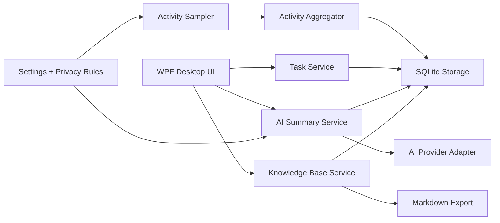

# 技术架构方案

## 1. 技术结论

MVP 推荐：

- Runtime: .NET 10 LTS
- UI: WPF
- Local DB: SQLite
- Search: SQLite FTS5
- Settings: JSON file
- Activity capture: Win32 APIs through P/Invoke
- AI: provider adapter with OpenAI-compatible request format where possible
- Knowledge base: SQLite canonical storage plus Markdown export

截至 2026-06-17，.NET 10 是 LTS 版本，适合作为新项目默认运行时。.NET 8 和 .NET 9 都将在 2026-11-10 结束支持，因此如果现在开新项目，除非受限于团队工具链，否则建议直接使用 .NET 10 LTS。

## 2. UI 技术选型

| 方案 | 优点 | 风险 | Taskora 结论 |
| --- | --- | --- | --- |
| WPF | Windows-only 成熟稳定；XAML/MVVM 生态成熟；透明悬浮窗口、托盘、Win32 API 集成方便；资源占用可控 | 默认观感不如 WinUI 现代，需要设计系统和样式投入 | MVP 推荐 |
| WinUI 3 | 微软现代 Windows UI；Fluent 控件；Windows App SDK 能力强 | 桌面便签、多窗口、托盘、部署和旧系统兼容会有更多摩擦 | 适合后续重做主窗口或局部引入 |
| Avalonia | .NET 跨平台；XAML 思路接近 WPF；控件和样式能力强 | Taskora 第一版 Windows-only，跨平台收益暂时不高；Win32 集成仍要写平台层 | 后续跨平台再考虑 |
| Electron | Web 技术开发快；生态大；跨平台 | 常驻内存基线偏高；Win32 activity capture 需要 native bridge；和低资源目标冲突 | 不推荐 MVP |

## 3. 解决方案结构

建议 solution：

```text
Taskora.sln
src/
  Taskora.Desktop/
  Taskora.Core/
  Taskora.Activity/
  Taskora.Tasks/
  Taskora.AI/
  Taskora.KnowledgeBase/
  Taskora.Storage/
  Taskora.Settings/
tests/
  Taskora.Core.Tests/
  Taskora.Activity.Tests/
  Taskora.Storage.Tests/
```

模块职责：

- Taskora.Desktop：WPF UI、托盘、桌面便签窗口、设置页。
- Taskora.Core：领域模型、时间处理、应用服务接口。
- Taskora.Activity：前台窗口采样、空闲检测、activity span 聚合。
- Taskora.Tasks：任务状态机、任务会话、进展记录。
- Taskora.AI：provider adapter、prompt 构建、AI 输出解析。
- Taskora.KnowledgeBase：知识条目、搜索、Markdown 导出。
- Taskora.Storage：SQLite 连接、迁移、repository。
- Taskora.Settings：JSON 配置、隐私规则、provider 配置。

## 4. 运行时组件



## 5. 桌面悬浮便签实现

WPF 方案：

- 每个显示中的任务对应一个 `TaskNoteWindow`。
- `WindowStyle=None`，`ShowInTaskbar=false`。
- 支持 `Topmost` 配置：固定在桌面或置顶。
- 使用 `ResizeMode=NoResize` 起步，后续支持缩放。
- 位置、大小、折叠状态存储到 SQLite 或 settings JSON。
- 右键 `ContextMenu` 绑定 task commands。
- 双击打开任务详情页。

注意：

- 多显示器环境要保存屏幕工作区坐标，并在显示器变化后做边界修正。
- 不建议第一版做复杂“嵌入桌面层级”。普通无边框窗口更稳。
- 便签关闭应解释为隐藏，不等于删除任务。

## 6. 前台应用记录实现

采样流程：

1. 定时器每 2 秒触发。
2. 调用 `GetForegroundWindow()` 获取前台窗口句柄。
3. 调用 `GetWindowThreadProcessId()` 获取进程 ID。
4. 通过 .NET `Process.GetProcessById()` 获取进程名和主模块信息。
5. 调用 `GetWindowTextW()` 获取窗口标题。
6. 调用 `GetLastInputInfo()` 判断用户是否空闲。
7. 应用隐私规则。
8. 如果 app/title/idle 状态和上一段一致，延长当前 span。
9. 如果发生变化，结束上一段并缓冲写入 SQLite。

推荐参数：

- SamplingIntervalSeconds: 2。
- IdleThresholdSeconds: 180。
- FlushIntervalSeconds: 10。
- MaxBufferedSpans: 50。

活动段合并规则：

- 同一应用、同一窗口标题、同一隐私状态、同一任务、idle 状态一致，则继续同一段。
- title 为空时仍按进程名记录。
- private 应用只保存 `process_name` 或 `Private App`，窗口标题保存为 null 或 `[hidden]`。

## 7. 空闲判断

使用 `GetLastInputInfo()` 获得当前会话最后输入时间，然后用系统 tick count 计算 idle seconds。

规则：

- idle seconds 小于阈值：active。
- idle seconds 大于阈值：idle。
- 从 active 变 idle 时，结束 active span 并创建 idle span。
- 从 idle 恢复 active 时，结束 idle span。

MVP 不需要监听键盘鼠标事件，也不需要全局 hook。

## 8. 任务与活动关联

MVP 关联策略：

- 当前有进行中任务时，activity span 默认关联该任务。
- 没有进行中任务时，span 不关联任务。
- 用户可在任务菜单中“关联当前软件”，保存简单规则。
- 隐私应用永远不自动补充标题细节。

后续可扩展：

- 基于应用规则自动关联任务。
- 基于窗口标题关键词关联项目。
- 基于浏览器域名关联任务。

## 9. AI 架构

AI 模块分层：

- `AiProvider`: 负责 HTTP 调用和模型配置。
- `PromptBuilder`: 把任务、进展、activity summary 转成 prompt。
- `SummaryService`: 控制数据范围确认、生成、保存和归档。
- `RedactionService`: 在 prompt 生成前脱敏。

Provider 配置：

- Name: OpenAICompatible, DeepSeek, Ollama, Custom。
- Endpoint。
- Model。
- API key。
- Timeout。
- Max input items。

原则：

- prompt 输入用聚合数据，而不是无节制塞全部原始时间线。
- private 数据默认不进入 prompt。
- 输出保存时记录 prompt version、model、input hash。

## 10. Storage 架构

SQLite 使用建议：

- 开启 WAL。
- 使用 migrations 管理 schema。
- 业务写入通过 repository/service。
- 高频 activity 写入先内存缓冲，再批量事务写入。
- 时间统一存 UTC，展示时转本地时区。
- 搜索使用 FTS5 虚拟表。

ORM 建议：

- MVP 可以用 EF Core + SQLite 做常规实体。
- 对 FTS5、批量写入、复杂统计查询保留 raw SQL。
- 如果追求更低开销，也可以直接用 `Microsoft.Data.Sqlite`。

## 11. 性能策略

- Activity sampler 使用后台单线程定时任务。
- 采样只做轻量 Win32 调用，不做 AI 分析。
- 写库批处理。
- UI 用 ViewModel 定时刷新，不每秒重算全量统计。
- 今日统计可以按需查询，常用聚合可做缓存。
- AI 只在用户点击时执行。

## 12. 错误处理

需要处理：

- 前台窗口句柄为空。
- 进程已经退出。
- 无权限读取进程模块路径。
- 窗口标题为空。
- 数据库被锁。
- AI provider 超时。
- 应用异常退出导致 task session 未关闭。

恢复策略：

- 采样失败不弹窗，只记录 debug log。
- 数据库写入失败进入重试队列。
- 未关闭 task session 下次启动标记为 interrupted。
- AI 失败保留可重试草稿输入。

## 13. 官方技术参考

- .NET support policy: https://dotnet.microsoft.com/en-us/platform/support/policy/dotnet-core
- WPF documentation: https://learn.microsoft.com/en-us/dotnet/desktop/wpf/
- WinUI 3 documentation: https://learn.microsoft.com/en-us/windows/apps/winui/winui3/
- Windows App SDK: https://learn.microsoft.com/en-us/windows/apps/windows-app-sdk/
- GetForegroundWindow: https://learn.microsoft.com/en-us/windows/win32/api/winuser/nf-winuser-getforegroundwindow
- GetWindowTextW: https://learn.microsoft.com/en-us/windows/win32/api/winuser/nf-winuser-getwindowtextw
- GetWindowThreadProcessId: https://learn.microsoft.com/en-us/windows/win32/api/winuser/nf-winuser-getwindowthreadprocessid
- GetLastInputInfo: https://learn.microsoft.com/en-us/windows/win32/api/winuser/nf-winuser-getlastinputinfo
- SQLite FTS5: https://www.sqlite.org/fts5.html
- Microsoft.Data.Sqlite: https://learn.microsoft.com/en-us/dotnet/standard/data/sqlite/

