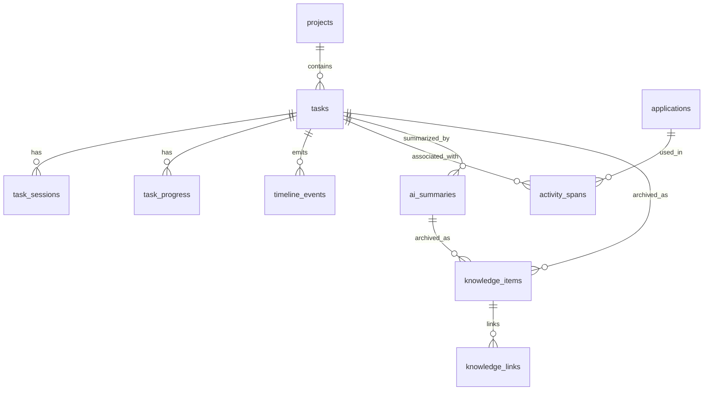

# 数据库设计

## 1. 总体原则

数据库文件：

```text
taskora.db
```

原则：

- SQLite 作为第一版唯一数据库。
- UTC 时间存储，UI 根据本地时区展示。
- 业务主键使用 TEXT 类型 GUID/ULID，便于未来同步。
- 高频活动记录批量写入。
- 隐私命中后不保存原始窗口标题。
- 全文搜索用 SQLite FTS5。
- 向量检索后续版本再加，不阻塞 MVP。

配置文件：

```text
taskora.settings.json
```

知识库导出目录：

```text
Taskora Knowledge Base/
```

## 2. 核心关系



## 3. Schema SQL

```sql
PRAGMA foreign_keys = ON;

CREATE TABLE schema_migrations (
  version INTEGER PRIMARY KEY,
  name TEXT NOT NULL,
  applied_at TEXT NOT NULL
);

CREATE TABLE projects (
  id TEXT PRIMARY KEY,
  name TEXT NOT NULL,
  color TEXT NULL,
  description TEXT NULL,
  created_at TEXT NOT NULL,
  updated_at TEXT NOT NULL,
  archived_at TEXT NULL
);

CREATE TABLE tasks (
  id TEXT PRIMARY KEY,
  project_id TEXT NULL REFERENCES projects(id) ON DELETE SET NULL,
  title TEXT NOT NULL,
  description TEXT NULL,
  status TEXT NOT NULL CHECK (status IN ('todo', 'in_progress', 'paused', 'completed', 'archived')),
  priority INTEGER NOT NULL DEFAULT 0,
  due_at TEXT NULL,
  created_at TEXT NOT NULL,
  updated_at TEXT NOT NULL,
  started_at TEXT NULL,
  completed_at TEXT NULL,
  archived_at TEXT NULL,
  note_x REAL NULL,
  note_y REAL NULL,
  note_width REAL NULL,
  note_height REAL NULL,
  note_collapsed INTEGER NOT NULL DEFAULT 0,
  note_visible INTEGER NOT NULL DEFAULT 1
);

CREATE INDEX idx_tasks_status ON tasks(status);
CREATE INDEX idx_tasks_due_at ON tasks(due_at);
CREATE INDEX idx_tasks_project_id ON tasks(project_id);

CREATE TABLE task_sessions (
  id TEXT PRIMARY KEY,
  task_id TEXT NOT NULL REFERENCES tasks(id) ON DELETE CASCADE,
  started_at TEXT NOT NULL,
  ended_at TEXT NULL,
  duration_seconds INTEGER NOT NULL DEFAULT 0,
  ended_reason TEXT NULL CHECK (ended_reason IN ('paused', 'completed', 'switched_task', 'interrupted', 'manual')),
  created_at TEXT NOT NULL
);

CREATE INDEX idx_task_sessions_task_id ON task_sessions(task_id);
CREATE INDEX idx_task_sessions_started_at ON task_sessions(started_at);

CREATE TABLE applications (
  id TEXT PRIMARY KEY,
  process_name TEXT NOT NULL,
  display_name TEXT NULL,
  executable_path_hash TEXT NULL,
  category TEXT NULL,
  is_private INTEGER NOT NULL DEFAULT 0,
  created_at TEXT NOT NULL,
  updated_at TEXT NOT NULL,
  UNIQUE(process_name, executable_path_hash)
);

CREATE INDEX idx_applications_process_name ON applications(process_name);

CREATE TABLE activity_spans (
  id TEXT PRIMARY KEY,
  application_id TEXT NULL REFERENCES applications(id) ON DELETE SET NULL,
  task_id TEXT NULL REFERENCES tasks(id) ON DELETE SET NULL,
  started_at TEXT NOT NULL,
  ended_at TEXT NOT NULL,
  duration_seconds INTEGER NOT NULL,
  process_id INTEGER NULL,
  process_name TEXT NOT NULL,
  window_title TEXT NULL,
  normalized_window_title TEXT NULL,
  is_idle INTEGER NOT NULL DEFAULT 0,
  is_private INTEGER NOT NULL DEFAULT 0,
  capture_level TEXT NOT NULL DEFAULT 'app_title',
  created_at TEXT NOT NULL
);

CREATE INDEX idx_activity_spans_started_at ON activity_spans(started_at);
CREATE INDEX idx_activity_spans_task_id ON activity_spans(task_id);
CREATE INDEX idx_activity_spans_application_id ON activity_spans(application_id);
CREATE INDEX idx_activity_spans_private ON activity_spans(is_private);

CREATE TABLE task_progress (
  id TEXT PRIMARY KEY,
  task_id TEXT NOT NULL REFERENCES tasks(id) ON DELETE CASCADE,
  session_id TEXT NULL REFERENCES task_sessions(id) ON DELETE SET NULL,
  occurred_at TEXT NOT NULL,
  done_text TEXT NULL,
  blocker_text TEXT NULL,
  next_text TEXT NULL,
  source_application_id TEXT NULL REFERENCES applications(id) ON DELETE SET NULL,
  source_process_name TEXT NULL,
  source_window_title TEXT NULL,
  is_private_context INTEGER NOT NULL DEFAULT 0,
  created_at TEXT NOT NULL,
  updated_at TEXT NOT NULL
);

CREATE INDEX idx_task_progress_task_id ON task_progress(task_id);
CREATE INDEX idx_task_progress_occurred_at ON task_progress(occurred_at);

CREATE TABLE timeline_events (
  id TEXT PRIMARY KEY,
  occurred_at TEXT NOT NULL,
  event_type TEXT NOT NULL,
  task_id TEXT NULL REFERENCES tasks(id) ON DELETE SET NULL,
  activity_span_id TEXT NULL REFERENCES activity_spans(id) ON DELETE SET NULL,
  progress_id TEXT NULL REFERENCES task_progress(id) ON DELETE SET NULL,
  payload_json TEXT NULL,
  created_at TEXT NOT NULL
);

CREATE INDEX idx_timeline_events_occurred_at ON timeline_events(occurred_at);
CREATE INDEX idx_timeline_events_task_id ON timeline_events(task_id);
CREATE INDEX idx_timeline_events_event_type ON timeline_events(event_type);

CREATE TABLE ai_summaries (
  id TEXT PRIMARY KEY,
  summary_type TEXT NOT NULL CHECK (summary_type IN ('daily', 'weekly', 'task', 'project', 'custom')),
  task_id TEXT NULL REFERENCES tasks(id) ON DELETE SET NULL,
  project_id TEXT NULL REFERENCES projects(id) ON DELETE SET NULL,
  scope_start TEXT NULL,
  scope_end TEXT NULL,
  title TEXT NOT NULL,
  content_markdown TEXT NOT NULL,
  prompt_version TEXT NOT NULL,
  model_provider TEXT NOT NULL,
  model_name TEXT NOT NULL,
  input_hash TEXT NOT NULL,
  input_snapshot_json TEXT NULL,
  created_at TEXT NOT NULL,
  updated_at TEXT NOT NULL,
  user_accepted_at TEXT NULL,
  archived_at TEXT NULL
);

CREATE INDEX idx_ai_summaries_type ON ai_summaries(summary_type);
CREATE INDEX idx_ai_summaries_task_id ON ai_summaries(task_id);
CREATE INDEX idx_ai_summaries_scope ON ai_summaries(scope_start, scope_end);

CREATE TABLE knowledge_items (
  id TEXT PRIMARY KEY,
  source_type TEXT NOT NULL CHECK (source_type IN ('task', 'progress', 'daily_summary', 'weekly_summary', 'task_summary', 'project_note', 'imported_document')),
  source_id TEXT NULL,
  project_id TEXT NULL REFERENCES projects(id) ON DELETE SET NULL,
  task_id TEXT NULL REFERENCES tasks(id) ON DELETE SET NULL,
  title TEXT NOT NULL,
  body_markdown TEXT NOT NULL,
  content_hash TEXT NOT NULL,
  occurred_at TEXT NULL,
  created_at TEXT NOT NULL,
  updated_at TEXT NOT NULL,
  archived_at TEXT NULL,
  exported_markdown_path TEXT NULL
);

CREATE INDEX idx_knowledge_items_source ON knowledge_items(source_type, source_id);
CREATE INDEX idx_knowledge_items_task_id ON knowledge_items(task_id);
CREATE INDEX idx_knowledge_items_project_id ON knowledge_items(project_id);
CREATE INDEX idx_knowledge_items_occurred_at ON knowledge_items(occurred_at);

CREATE TABLE knowledge_links (
  id TEXT PRIMARY KEY,
  from_item_id TEXT NOT NULL REFERENCES knowledge_items(id) ON DELETE CASCADE,
  to_item_id TEXT NOT NULL REFERENCES knowledge_items(id) ON DELETE CASCADE,
  link_type TEXT NOT NULL,
  created_at TEXT NOT NULL
);

CREATE TABLE tags (
  id TEXT PRIMARY KEY,
  name TEXT NOT NULL UNIQUE,
  color TEXT NULL,
  created_at TEXT NOT NULL
);

CREATE TABLE entity_tags (
  id TEXT PRIMARY KEY,
  entity_type TEXT NOT NULL,
  entity_id TEXT NOT NULL,
  tag_id TEXT NOT NULL REFERENCES tags(id) ON DELETE CASCADE,
  created_at TEXT NOT NULL,
  UNIQUE(entity_type, entity_id, tag_id)
);

CREATE INDEX idx_entity_tags_entity ON entity_tags(entity_type, entity_id);

CREATE TABLE privacy_rules (
  id TEXT PRIMARY KEY,
  rule_type TEXT NOT NULL CHECK (rule_type IN ('process_name', 'window_title', 'website_domain')),
  pattern TEXT NOT NULL,
  match_type TEXT NOT NULL CHECK (match_type IN ('exact', 'contains', 'regex')),
  action TEXT NOT NULL CHECK (action IN ('exclude', 'redact_title', 'mark_private')),
  enabled INTEGER NOT NULL DEFAULT 1,
  created_at TEXT NOT NULL,
  updated_at TEXT NOT NULL
);

CREATE INDEX idx_privacy_rules_enabled ON privacy_rules(enabled);
```

## 4. Full Text Search

FTS5 表：

```sql
CREATE VIRTUAL TABLE knowledge_items_fts USING fts5(
  title,
  body_markdown,
  source_type UNINDEXED,
  content='knowledge_items',
  content_rowid='rowid'
);
```

注意：如果使用 TEXT 主键，FTS external content 需要一个 INTEGER rowid 映射。实际实现时可以给 `knowledge_items` 增加 `rowid` 默认隐式 rowid，并维护 FTS trigger。

触发器示例：

```sql
CREATE TRIGGER knowledge_items_ai AFTER INSERT ON knowledge_items BEGIN
  INSERT INTO knowledge_items_fts(rowid, title, body_markdown, source_type)
  VALUES (new.rowid, new.title, new.body_markdown, new.source_type);
END;

CREATE TRIGGER knowledge_items_ad AFTER DELETE ON knowledge_items BEGIN
  INSERT INTO knowledge_items_fts(knowledge_items_fts, rowid, title, body_markdown, source_type)
  VALUES ('delete', old.rowid, old.title, old.body_markdown, old.source_type);
END;

CREATE TRIGGER knowledge_items_au AFTER UPDATE ON knowledge_items BEGIN
  INSERT INTO knowledge_items_fts(knowledge_items_fts, rowid, title, body_markdown, source_type)
  VALUES ('delete', old.rowid, old.title, old.body_markdown, old.source_type);
  INSERT INTO knowledge_items_fts(rowid, title, body_markdown, source_type)
  VALUES (new.rowid, new.title, new.body_markdown, new.source_type);
END;
```

MVP 如果想降低复杂度，也可以使用普通 FTS 内容表，不做 external content，后续再优化。

## 5. 常用统计查询

今日应用用时：

```sql
SELECT
  process_name,
  SUM(duration_seconds) AS total_seconds,
  COUNT(*) AS span_count
FROM activity_spans
WHERE started_at >= $day_start
  AND started_at < $day_end
  AND is_idle = 0
GROUP BY process_name
ORDER BY total_seconds DESC;
```

今日任务用时：

```sql
SELECT
  t.id,
  t.title,
  SUM(s.duration_seconds) AS total_seconds
FROM tasks t
JOIN task_sessions s ON s.task_id = t.id
WHERE s.started_at >= $day_start
  AND s.started_at < $day_end
GROUP BY t.id, t.title
ORDER BY total_seconds DESC;
```

任务时间线：

```sql
SELECT occurred_at, event_type, payload_json
FROM timeline_events
WHERE task_id = $task_id
ORDER BY occurred_at ASC;
```

知识库搜索：

```sql
SELECT k.*
FROM knowledge_items_fts f
JOIN knowledge_items k ON k.rowid = f.rowid
WHERE knowledge_items_fts MATCH $query
ORDER BY rank;
```

## 6. Settings JSON

示例：

```json
{
  "recording": {
    "enabled": true,
    "samplingIntervalSeconds": 2,
    "idleThresholdSeconds": 180,
    "flushIntervalSeconds": 10
  },
  "privacy": {
    "hidePrivateWindowTitles": true,
    "confirmBeforeAi": true,
    "defaultPrivateProcesses": [
      "WeChat.exe",
      "QQ.exe",
      "Telegram.exe",
      "1Password.exe"
    ]
  },
  "ai": {
    "provider": "OpenAICompatible",
    "endpoint": "",
    "model": "",
    "apiKeySecretName": "taskora-ai-key"
  },
  "knowledgeBase": {
    "directory": "Taskora Knowledge Base",
    "autoExportMarkdown": true
  }
}
```

API key 不建议明文放在 JSON。Windows 上优先使用 Credential Manager 或 DPAPI 加密保存。

